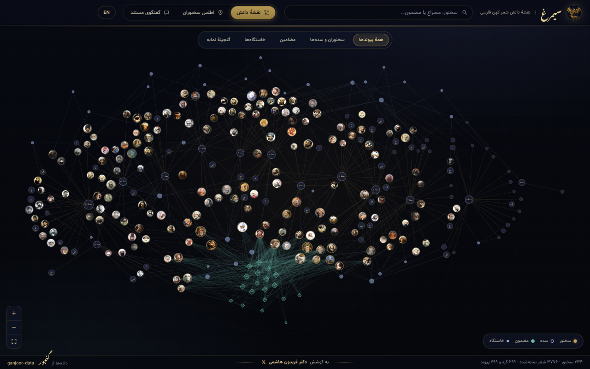
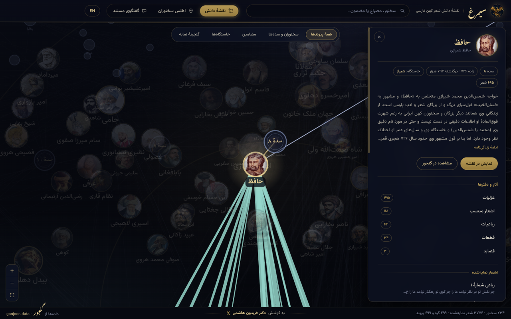
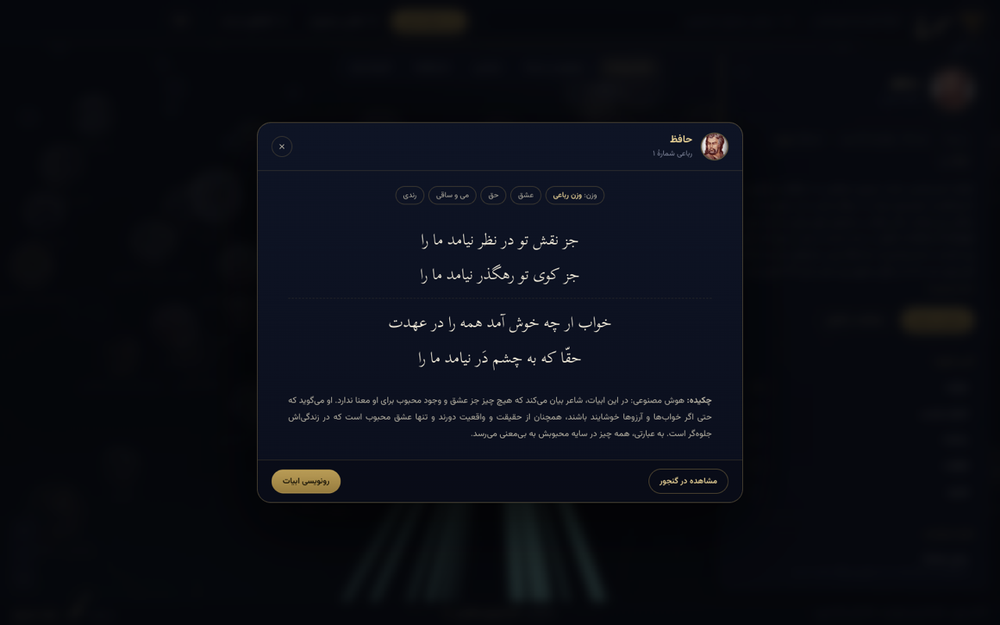
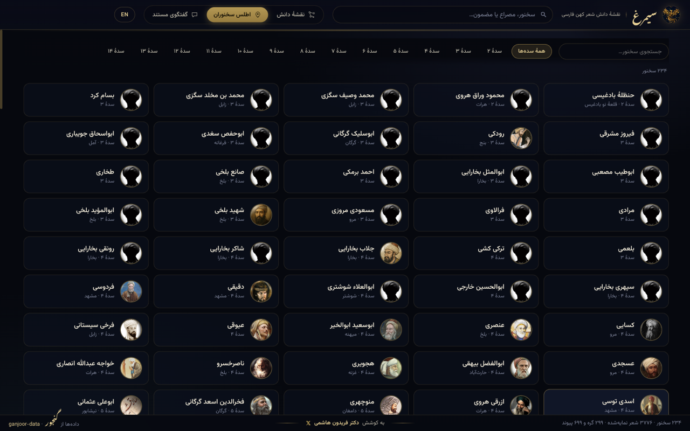
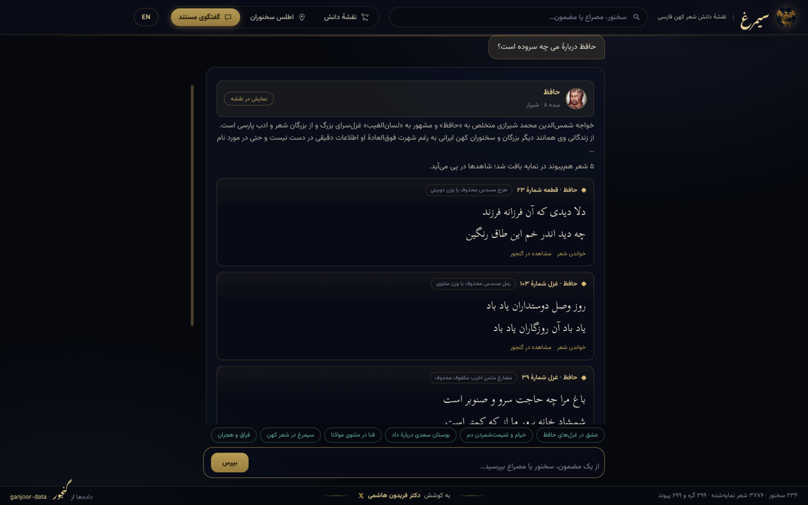

# Simorgh (سیمرغ)
### Knowledge Graph & Celestial Night Atlas of Classical Persian Poetry

> **Live Application**: [https://zorost.github.io/simorgh/](https://zorost.github.io/simorgh/)  
> **Documentation**: [English](README.md) · [فارسی](README.fa.md)  
> **Author**: Fereydun Hashemi

[](https://zorost.github.io/simorgh/)

---

## Live Interactive Map

Explore the live visual knowledge graph and cited verse explorer directly in your browser:

### [https://zorost.github.io/simorgh/](https://zorost.github.io/simorgh/)

No installations, no accounts, and no mandatory API keys required. Everything runs directly on GitHub Pages using public static data.

---

## Overview

**Simorgh** is an interactive celestial knowledge graph and historical atlas of the Persian poetry corpus from [Ganjoor](https://ganjoor.net):

- **234 Classical Poets**: Complete lineage spanning from the 3rd to 14th centuries Hijri (Roodaki, Ferdowsi, Khayyam, Nezami, Attar, Sanai, Rumi, Saadi, Hafez, Jami, Bidel, Saeb, Parvin, Shahriar, and beyond).
- **Literary Schools**: Visual clustering by Khorasani, Iraqi, Indian (Sabk-e Hendi), Bazgasht, and Contemporary schools.
- **Astrolabe & Sacred Geometry Visuals**: Celestial chart layout with Hermetic geometry and historical poet portraits.
- **Persian-Normalized Search**: Instant BM25 retrieval over a 3,776-poem canon slice with normalization for vocalization, alef variants, kaf/yeh, and zero-width non-joiners.
- **Cited Verse Explorer & Chat**: Client-side literary reasoning that grounds every claim in verified couplets, metres, and poet connections without inventing verses.

---

## Visual Tour

### 1. The Celestial Knowledge Graph
Interactive force-directed graph with poet portrait medallions, literary schools, and thematic constellation lines:



### 2. Poet Lineage & Inspector Drawer
Clicking any poet opens their biographical details, literary school, historical era, and indexed poems:



### 3. Centered Reading Room
Focused, distraction-free reader for classical distichs and hemistichs with metre identification and direct Ganjoor link:



### 4. Historical Poet Atlas
Chronological catalog of 234 poets organized by century and school with portrait medallions:



### 5. Cited Literary Chat
Instant in-browser verse exploration and motif analysis citing exact couplets and metres with zero external key requirements:



---

## Key Features

1. **The Graph Is the Interface**: Rather than simple text lists, poets, schools, themes, and metres form an interconnected celestial graph.
2. **High-Fidelity Persian Typography**: Typeset using `Vazirmatn` for interface elements and `Scheherazade New` for classical verses.
3. **Zero Cost & In-Browser Intelligence**: The cited conversational engine runs directly on the client using normalized BM25 indexing and graph ontology. Optional placeholders exist for future external endpoints.
4. **Lightweight Architecture**: Consumes public static data from [ganjoor/ganjoor-data](https://github.com/ganjoor/ganjoor-data) over HTTPS rather than requiring heavy database forks.

---

## Quick Start

### Local Development

```bash
git clone https://github.com/zorost/simorgh.git
cd simorgh
npm install
npm run dev
```

Open `http://localhost:5173` in your browser.

### Building & Testing

```bash
npm test
npm run build
```

---

## Architecture

```
ganjoor-data (jsDelivr CDN)
        │
        ▼  scripts/build_corpus.py
public/data/
  ├── atlas.json        (234 published poets with metadata)
  ├── graph.json        (443 nodes and 843 grounded edges)
  ├── index.json        (3,776 canon poems, Persian-normalized)
  ├── themes.json       (19 central thematic motifs)
  └── poets/            (Cached circular portrait medallions)
        │
        ▼
Static Vite SPA (Canvas 2D + Vanilla ES Modules)
        │
        ▼
GitHub Pages (https://zorost.github.io/simorgh/)
```

---

## Author & Attribution

- **Author**: Fereydun Hashemi
- **Data Source**: Public domain classical poetry compiled by [Ganjoor](https://ganjoor.net) via [ganjoor/ganjoor-data](https://github.com/ganjoor/ganjoor-data).
- **License**: MIT License for Simorgh source code and interface.
